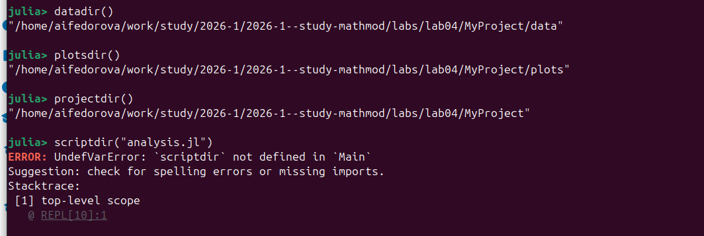
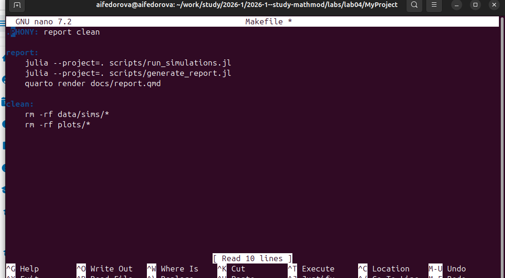

---
author:
  name: Федорова А. И.
  affiliation:
    - name: Российский университет дружбы народов
      country: Российская Федерация
      postal-code: 117198
      city: Москва
      address: ул. Миклухо-Маклая, д. 6
title: "Инструменты воспроизводимых исследований"
subtitle: "DrWatson. Лабораторная работа №4"
license: CC BY
date: today
date-format: "YYYY-MM-DD"
lang: ru

format:
  revealjs:
    theme: simple
    slide-number: true
    transition: slide
    toc: false
    incremental: false
    scrollable: false
  beamer:
    aspectratio: 169
    theme: metropolis
    section-titles: true
---

# Вводная часть

## Актуальность

- Воспроизводимость --- ключевое требование современной науки
- Научный проект требует чёткой структуры и контроля версий данных
- Ручное управление файлами симуляций приводит к ошибкам
- DrWatson решает эти проблемы на уровне экосистемы Julia

## Цель работы

- Освоить пакет **DrWatson** для организации воспроизводимых проектов
- Изучить функции навигации, сохранения и сбора результатов
- Автоматизировать сборку отчёта с помощью Makefile и Quarto

## Задачи

- Установить DrWatson и инициализировать проект `MyProject`
- Проверить функции `datadir()`, `plotsdir()`, `projectdir()`
- Сохранить результаты через `savename` + `safesave`
- Запустить пакетные симуляции через `dict_list`
- Собрать результаты в DataFrame через `collect_results`
- Создать Makefile и шаблон проекта через PkgTemplates

## Материалы и методы

- Язык программирования: **Julia**
- Пакеты: `DrWatson`, `PkgTemplates`, `DataFrames`, `BSON`, `JLD2`
- Автоматизация: `Makefile`
- Рендеринг отчёта: `Quarto`

# Теоретическая часть

## Что такое DrWatson

- Пакет Julia для организации воспроизводимых научных проектов
- Стандартизирует структуру директорий
- Предоставляет переносимые пути к файлам
- Автоматизирует именование и сохранение данных
- Поддерживает сбор результатов из множества файлов

## Структура проекта DrWatson

```
MyProject/
├── Project.toml      # Зависимости
├── Manifest.toml     # Точные версии
├── data/
│   ├── sims/         # Результаты симуляций
│   ├── exp_raw/      # Сырые данные
│   └── exp_pro/      # Обработанные данные
├── scripts/          # Скрипты анализа
├── src/              # Исходный код
└── _research/        # Черновики
```

## Ключевые функции DrWatson

| Функция | Назначение |
|---|---|
| `datadir()` | Путь к `data/` |
| `plotsdir()` | Путь к `plots/` |
| `projectdir()` | Корень проекта |
| `savename(p, ext)` | Имя файла по параметрам |
| `safesave(path, d)` | Сохранение без перезаписи |
| `collect_results(dir)` | Сбор в DataFrame |
| `dict_list(d)` | Декартово произведение |

# Выполнение работы

## Установка и компиляция зависимостей

{width=85%}

## Проверка функций навигации

{width=85%}

## Замечание: scriptdir vs scriptsdir

- В DrWatson функция называется **`scriptsdir()`** (с **s** на конце)
- `scriptdir` --- несуществующая функция → `UndefVarError`
- Все функции навигации DrWatson используют форму во множественном числе:
  `datadir`, `plotsdir`, `scriptsdir`, `srcdir`

## Сохранение результатов симуляции

{width=85%}

## Как работает savename

```julia
params = @dict(α=0.1, β=2.0)
filename = savename(params, "jld2")
# → "α=0.1_β=2.0.jld2"

results = Dict(:data => rand(10))
safesave(datadir("sims", filename), results)
```

- `@dict` создаёт словарь с именами переменных как ключами
- `savename` формирует уникальное имя файла
- `safesave` не перезаписывает существующие файлы

## Пакетная обработка параметров

{width=85%}

## Решение: модуль в src/

```julia
# src/MyProject.jl
module MyProject
export simulate

function simulate(params)
    # логика симуляции
end
end
```

- Пользовательские функции выносятся в `src/`
- Подключаются через `using MyProject`
- Это стандартная практика DrWatson

## Сбор результатов в DataFrame

{width=85%}

## Почему нет столбцов α и β

- `safesave` сохранил только ключи из `results`
- Параметры `α`, `β` не вошли в файл
- **Правильно:** объединять параметры с результатами:

```julia
safesave(path, merge(params, results))
# или использовать tagsave()
```

## Makefile для автоматизации

{width=85%}

## Структура Makefile

```makefile
.PHONY: report clean

report:
    julia --project=. scripts/run_simulations.jl
    julia --project=. scripts/generate_report.jl
    quarto render docs/report.qmd

clean:
    rm -rf data/sims/*
    rm -rf plots/*
```

## Создание проекта через PkgTemplates

{width=85%}

## Шаблон через PkgTemplates

```julia
using PkgTemplates
t = Template(;
    dir="~/Projects",
    julia=v"1.9",
    plugins=[DrWatsonPlugin()]
)
t("MyNewProject")
```

- Генерирует полную структуру проекта DrWatson
- Настраивает целевую версию Julia
- Подключает нужные плагины автоматически

# Результаты

## Рабочий процесс DrWatson

::: incremental

1. `initialize_project()` → стандартная структура директорий
2. `@quickactivate` → активация окружения проекта
3. `savename()` + `safesave()` → именованное сохранение данных
4. `dict_list()` → пакетные симуляции по параметрам
5. `collect_results()` → сбор результатов в DataFrame
6. Makefile + Quarto → автоматический рендеринг отчёта

:::

## Выявленные ошибки и их решения

::: incremental

- `scriptdir` → правильно: **`scriptsdir()`**
- `simulate` не определена → выносить в **`src/MyProject.jl`**
- Столбцы параметров не в DataFrame → использовать **`merge(params, results)`** или **`tagsave`**

:::

## Выводы

- DrWatson обеспечивает воспроизводимость через стандартизацию структуры
- `savename` + `safesave` исключают случайную перезапись данных
- `collect_results` автоматизирует сбор результатов из множества файлов
- Makefile + Quarto образуют полный пайплайн от симуляций до отчёта
- PkgTemplates позволяет тиражировать структуру проекта
