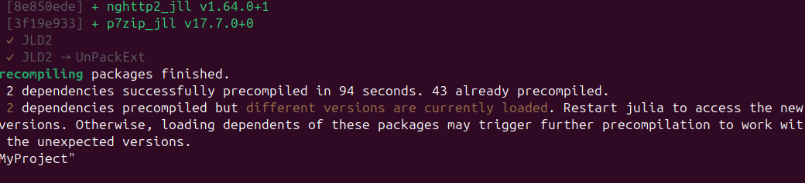
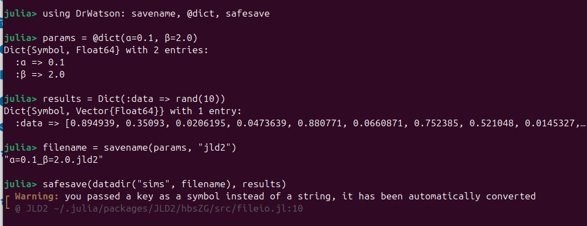
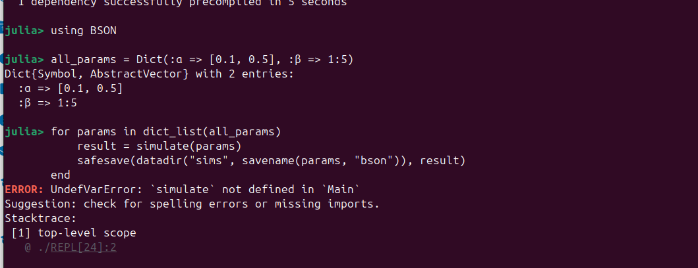
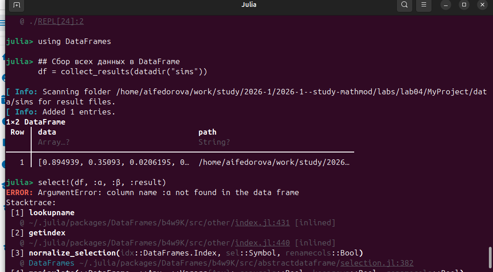
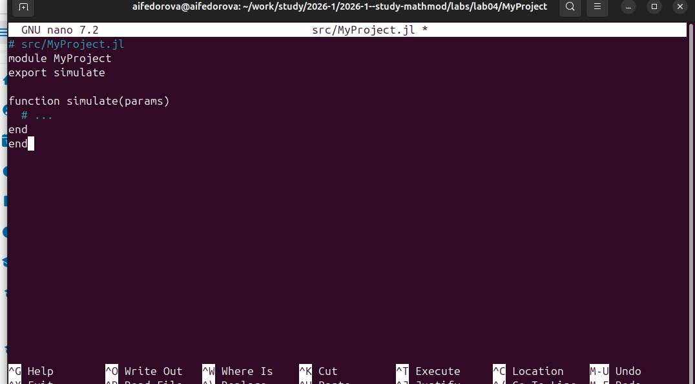

---
author:
  name: Федорова А. И.
  affiliation:
    - name: Российский университет дружбы народов
      country: Российская Федерация
      postal-code: 117198
      city: Москва
      address: ул. Миклухо-Маклая, д. 6

title: "Отчёт по лабораторной работе №4"
subtitle: "Инструменты воспроизводимых исследований. DrWatson"
license: "CC BY"
---

# Цель работы

Освоить инструменты для организации воспроизводимых научных исследований на языке
Julia с использованием пакета DrWatson. Изучить структуру научного проекта, функции
навигации, сохранения и сбора результатов, а также автоматизацию сборки отчёта.

# Задание

1. Установить пакет DrWatson и инициализировать проект `MyProject`.
2. Изучить стандартные функции навигации по проекту: `datadir()`, `plotsdir()`, `projectdir()`, `scriptsdir()`.
3. Сохранить результаты симуляции с помощью `savename`, `@dict`, `safesave`.
4. Выполнить пакетную обработку параметров через `dict_list` и цикл симуляций.
5. Собрать результаты из файлов в DataFrame с помощью `collect_results`.
6. Создать Makefile для автоматизации запуска скриптов и рендеринга отчёта.
7. Создать шаблон нового проекта через `PkgTemplates.jl` с плагином `DrWatsonPlugin`.

# Теоретическое введение

**DrWatson** --- пакет Julia, разработанный специально для организации воспроизводимых
научных проектов. Он предоставляет соглашения об именовании файлов, навигацию по
структуре проекта и утилиты для управления данными.

Стандартная структура проекта, создаваемая DrWatson:

```
MyProject/
├── Project.toml        # Описание зависимостей
├── Manifest.toml       # Точные версии пакетов
├── data/
│   ├── sims/           # Результаты симуляций
│   ├── exp_raw/        # Сырые экспериментальные данные
│   └── exp_pro/        # Обработанные данные
├── scripts/            # Скрипты для анализа
├── src/                # Исходный код проекта
└── _research/          # Черновики и временные файлы
```


| Функция | Описание |
|---|---|
| `datadir()` | Путь к директории `data/` |
| `plotsdir()` | Путь к директории `plots/` |
| `projectdir()` | Корень проекта |
| `srcdir()` | Путь к директории `src/` |
| `savename(params, ext)` | Имя файла по словарю параметров |
| `safesave(path, data)` | Сохранение без перезаписи |
| `collect_results(dir)` | Сбор результатов в DataFrame |
| `dict_list(d)` | Декартово произведение параметров |
| `@dict(a=1, b=2)` | Создание словаря с именованными ключами |
| `@quickactivate` | Автоматическая активация окружения |

: Основные функции пакета DrWatson {#tbl-drwatson}

**PkgTemplates.jl** позволяет генерировать стандартную структуру Julia-проекта
с нужными плагинами, в том числе `DrWatsonPlugin()`.

**Makefile** используется для автоматизации запуска скриптов и рендеринга
финального документа через Quarto.

# Выполнение лабораторной работы

## Установка пакетов и компиляция зависимостей

Сначала был установлен пакет DrWatson и инициализирован проект `MyProject`.
В процессе Julia скомпилировала 2 новых зависимости --- `nghttp2_jll v1.64.0+1`
и `p7zip_jll v17.7.0+0`, а также подтвердила компиляцию пакетов JLD2.
Система сообщила, что 43 пакета уже были предкомпилированы,
и рекомендовала перезапустить Julia для применения новых версий ([рис. @fig-001]).

{#fig-001 width=90%}

## Проверка функций навигации DrWatson

После активации проекта были проверены функции навигации.
Вызовы `datadir()`, `plotsdir()` и `projectdir()` корректно вернули абсолютные пути
к соответствующим директориям внутри `MyProject` ([рис. @fig-002]).

При попытке вызвать `scriptdir("analysis.jl")` возникла ошибка:

```
ERROR: UndefVarError: `scriptdir` not defined in `Main`
```

Это ожидаемо: в DrWatson нет функции `scriptdir` --- правильное название `scriptsdir()`
(с буквой **s** в конце, по аналогии с остальными функциями).

{#fig-002 width=90%}

## Сохранение результатов симуляции

Были импортированы `savename`, `@dict`, `safesave` из DrWatson.
Создан словарь параметров и словарь результатов с массивом из 10 случайных чисел:

```julia
params = @dict(α=0.1, β=2.0)
results = Dict(:data => rand(10))
```

Функция `savename(params, "jld2")` автоматически сформировала имя файла `"α=0.1_β=2.0.jld2"`.
Вызов `safesave(datadir("sims", filename), results)` сохранил данные,
выведя предупреждение о том, что символьный ключ `:data` был автоматически
конвертирован в строку `"data"` ([рис. @fig-003]).

{#fig-003 width=90%}

## Пакетная обработка параметров через dict_list

Был подключён пакет `BSON` и задан словарь всех параметров:

```julia
all_params = Dict(:α => [0.1, 0.5], :β => 1:5)
```

Функция `dict_list(all_params)` раскрывает это в 10 комбинаций параметров
(декартово произведение). Для каждой комбинации планировался вызов
пользовательской функции `simulate` и сохранение результата через `safesave`.

Однако при запуске цикла возникла ошибка ([рис. @fig-004]):

```
ERROR: UndefVarError: `simulate` not defined in `Main`
```

Функция `simulate` не была определена в текущей сессии.
Согласно рекомендациям DrWatson, пользовательские функции следует выносить в модуль
`src/MyProject.jl` и подключать через `using MyProject`.

{#fig-004 width=90%}

## Сбор результатов в DataFrame

После подключения `DataFrames` была вызвана функция `collect_results(datadir("sims"))`.
DrWatson просканировал папку `data/sims`, обнаружил 1 файл и добавил запись в DataFrame.
Итоговая таблица содержала столбцы `data` (массив значений) и `path` (путь к файлу) ([рис. @fig-005]).

При попытке выбрать столбцы `:α`, `:β`, `:result` через `select!` получена ошибка:

```
ArgumentError: column name :α not found in the data frame
```

Параметры `α` и `β` не попали в DataFrame, поскольку при сохранении через `safesave`
они не были включены в словарь результатов. Для корректного сбора параметров
следует использовать `tagsave` вместо `safesave`, либо объединять параметры
с результатами перед сохранением: `safesave(path, merge(params, results))`.

{#fig-005 width=90%}

## Создание Makefile для автоматизации

Был создан файл `Makefile` в корне проекта ([рис. @fig-006]):

```makefile
.PHONY: report clean

report:
    julia --project=. scripts/run_simulations.jl
    julia --project=. scripts/generate_report.jl
    quarto render docs/report.qmd

clean:
    rm -rf data/sims/*
    rm -rf plots/*
```

Цель `report` последовательно выполняет запуск симуляций, генерацию промежуточных
файлов и рендеринг финального документа через Quarto.
Цель `clean` очищает директории с результатами и графиками.

{#fig-006 width=90%}

## Создание нового проекта через PkgTemplates

Был создан скрипт `scripts/PkgTemplates.jl` для генерации нового проекта
по шаблону с интеграцией DrWatson ([рис. @fig-007]):

```julia
using PkgTemplates
t = Template(;
    dir="~/Projects",
    julia=v"1.9",
    plugins=[DrWatsonPlugin()]
)
t("MyNewProject")
```

Скрипт создаёт проект `MyNewProject` в директории `~/Projects` со стандартной
структурой DrWatson и настройками для Julia 1.9.

{#fig-007 width=90%}

# Выводы

В ходе лабораторной работы были освоены основные инструменты пакета DrWatson
для организации воспроизводимых научных исследований на Julia:

- инициализация проекта с помощью `initialize_project` и автоматическое создание
  стандартной структуры директорий;
- функции навигации по проекту (`datadir`, `plotsdir`, `projectdir`),
  позволяющие использовать переносимые пути независимо от расположения проекта;
- именование файлов по параметрам через `savename` и безопасное сохранение
  данных через `safesave` без риска перезаписи результатов;
- генерация комбинаций параметров через `dict_list` для пакетных симуляций;
- сбор результатов из нескольких файлов в единый DataFrame через `collect_results`;
- автоматизация рабочего процесса с помощью Makefile и Quarto;
- создание шаблонного проекта через PkgTemplates с плагином DrWatsonPlugin.

В процессе работы выявлены типичные ошибки: использование несуществующей функции
`scriptdir` вместо `scriptsdir`, отсутствие определения пользовательских функций
в текущей сессии, а также необходимость включать параметры симуляции в сохраняемый
словарь для корректного последующего анализа через `collect_results`.

# Список литературы {.unnumbered}

::: {#refs}
:::
