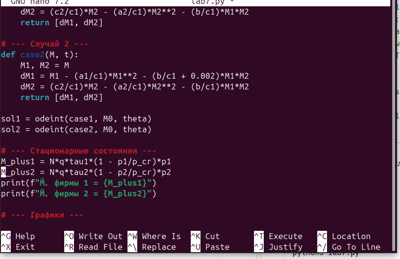
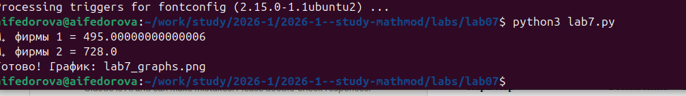
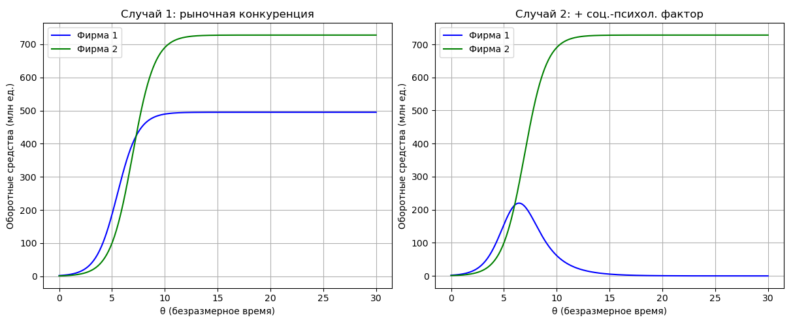

---
author:
  name: Федорова Анжелика Игоревна
title: "Лабораторная работа №8: Модель конкуренции двух фирм"
subtitle: Математическое моделирование рыночной конкуренции
date: today
date-format: "YYYY-MM-DD"
format:
  beamer:
    slide_level: 2
    aspectratio: 169
    section-titles: true
    theme: metropolis
  revealjs:
    slide-level: 2
    theme: moon
    transition: slide
---

# Вводная часть

## Цель работы

Изучить математическую модель конкуренции двух фирм на одном рынке,
реализовать численное решение системы дифференциальных уравнений
на языке **Python** для двух случаев конкуренции и проанализировать
динамику оборотных средств предприятий.

## Задачи

- Изучить математическую модель одной фирмы и конкуренции двух фирм
- Придумать собственный пример двух конкурирующих фирм с идентичным товаром
- Задать начальные значения и параметры модели
- Реализовать численное решение системы ОДУ (`scipy.integrate.odeint`)
- Построить графики изменения оборотных средств для двух случаев
- Найти стационарные состояния системы для первого случая
- Проанализировать полученные результаты

# Теоретическая часть

## Модель одной фирмы

Функция спроса товаров долговременного пользования:

$$Q = q\left(1 - \frac{p}{p_{cr}}\right)$$

Динамика оборотных средств:

$$\frac{dM}{dt} = -\frac{M\delta}{\tau} + Nq\left(1 - \frac{p}{p_{cr}}\right)p - \kappa$$

Стационарные состояния при $\kappa \approx 0$:

$$\tilde{M}_+ = Nq\frac{\tau}{\delta}\!\left(1 - \frac{\tilde{p}}{p_{cr}}\right)\tilde{p}$$

## Конкуренция двух фирм — Случай 1

Рыночная конкуренция: фирмы влияют друг на друга только через цену.
Коэффициент перед $M_1 M_2$ **одинаков** в обоих уравнениях.

$$\frac{dM_1}{d\theta} = M_1 - \frac{a_1}{c_1}M_1^2 - \frac{b}{c_1}M_1 M_2$$

$$\frac{dM_2}{d\theta} = \frac{c_2}{c_1}M_2 - \frac{a_2}{c_1}M_2^2 - \frac{b}{c_1}M_1 M_2$$

Ожидаемый результат: обе фирмы **сосуществуют**, каждая занимает свою долю рынка.

## Конкуренция двух фирм — Случай 2

Добавляется социально-психологический фактор: коэффициент перед $M_1 M_2$
в первом уравнении **увеличен** на 0.002.

$$\frac{dM_1}{d\theta} = M_1 - \frac{a_1}{c_1}M_1^2 - \!\left(\frac{b}{c_1} + 0{,}002\right)\!M_1 M_2$$

$$\frac{dM_2}{d\theta} = \frac{c_2}{c_1}M_2 - \frac{a_2}{c_1}M_2^2 - \frac{b}{c_1}M_1 M_2$$

Ожидаемый результат: фирма 1 **терпит банкротство**, фирма 2 монополизирует рынок.

## Коэффициенты модели (формула 16)

$$a_1 = \frac{p_{cr}}{\tau_1^2 \tilde{p}_1^2 Nq}, \quad
  a_2 = \frac{p_{cr}}{\tau_2^2 \tilde{p}_2^2 Nq}, \quad
  b   = \frac{p_{cr}}{\tau_1^2 \tau_2^2 \tilde{p}_1^2 \tilde{p}_2^2 Nq}$$

$$c_1 = \frac{p_{cr} - \tilde{p}_1}{\tau_1 \tilde{p}_1}, \qquad
  c_2 = \frac{p_{cr} - \tilde{p}_2}{\tau_2 \tilde{p}_2}$$

Безразмерное время: $\theta = t \cdot c_1$

# Реализация

## Описание выбранного примера

Два производителя **смартфонов среднего сегмента** в одной рыночной нише.
Потребители не имеют априорных предпочтений.

| Параметр | Обозн. | Фирма 1 | Фирма 2 |
|---|---|---|---|
| Критическая стоимость (тыс.) | $p_{cr}$ | 20 | 20 |
| Себестоимость (тыс.) | $\tilde{p}$ | 9 | 7 |
| Длительность цикла | $\tau$ | 10 | 16 |
| Нач. оборотные средства (млн) | $M_0$ | 2 | 1 |

Общие параметры: $N = 10$ тыс. потребителей, $q = 1$

## Скрипт lab8.py

## Параметры и коэффициенты

| Коэффициент | Формула | Значение |
|---|---|---|
| $a_1$ | $p_{cr}/(\tau_1^2 \tilde{p}_1^2 Nq)$ | 0.000247 |
| $a_2$ | $p_{cr}/(\tau_2^2 \tilde{p}_2^2 Nq)$ | 0.000159 |
| $b$ | $p_{cr}/(\tau_1^2\tau_2^2 \tilde{p}_1^2\tilde{p}_2^2 Nq)$ | 2×10⁻⁸ |
| $c_1$ | $(p_{cr}-\tilde{p}_1)/(\tau_1\tilde{p}_1)$ | 0.1222 |
| $c_2$ | $(p_{cr}-\tilde{p}_2)/(\tau_2\tilde{p}_2)$ | 0.1161 |

## Завершение выполнения скрипта

# Результаты

## Стационарные состояния (Случай 1, $\kappa = 0$)

$$\tilde{M}_+^{(1)} = 10 \cdot 1 \cdot 10 \cdot \left(1 - \tfrac{9}{20}\right) \cdot 9 = \mathbf{495 \text{ млн ед.}}$$

$$\tilde{M}_+^{(2)} = 10 \cdot 1 \cdot 16 \cdot \left(1 - \tfrac{7}{20}\right) \cdot 7 = \mathbf{728 \text{ млн ед.}}$$

- $\tilde{M}_+$ — **устойчивое** состояние, соответствует стабильной работе фирмы
- $\tilde{M}_-$ — неустойчивое состояние (при $\kappa = 0$ стремится к нулю)
- При $M < \tilde{M}_-$ оборотные средства падают → банкротство

## График: динамика оборотных средств

{width=90%}

## Анализ — Случай 1: рыночная конкуренция

- **Фирма 1** выходит на уровень $\approx$ **495 млн ед.** и остаётся на нём
- **Фирма 2** выходит на уровень $\approx$ **728 млн ед.** и остаётся на нём
- Рост оборотных средств идёт **независимо** — фирмы не мешают друг другу
- Это отражается в равном коэффициенте $b/c_1$ перед $M_1 M_2$ в обоих уравнениях

**Вывод:** при чисто рыночной конкуренции обе фирмы **сосуществуют**,
каждая захватывает свою долю рынка.

## Анализ — Случай 2: социально-психологический фактор

- Фирма 1 начинает расти, достигает локального максимума $\approx$ **220 млн ед.**
- Затем оборотные средства фирмы 1 падают → **банкротство**
- Фирма 2 достигает максимума $\approx$ **728 млн ед.** и монополизирует рынок

**Интерпретация:** добавка 0.002 моделирует лояльность бренду, рекламу
или сарафанное радио в пользу фирмы 2. Даже небольшое асимметричное
воздействие кардинально меняет исход конкуренции.

# Результаты

## Общий анализ

- **Случай 1** — устойчивое равновесие: более эффективная фирма захватывает
  бо́льшую долю рынка, но не вытесняет конкурента
- **Случай 2** — монополизация: небольшое нерыночное преимущество приводит
  к полному вытеснению фирмы 1
- **Стационарные состояния** точно совпадают с численным решением —
  графики выходят на значения 495 и 728 млн ед.
- Фирма 2 успешнее в обоих случаях за счёт меньшей себестоимости ($\tilde{p}_2 < \tilde{p}_1$)

# Выводы

## Итоги работы

::: incremental

- Реализована математическая модель конкуренции двух фирм на Python
  с использованием `scipy.integrate.odeint`
- Выбран собственный пример — рынок смартфонов среднего сегмента
- Построены графики динамики оборотных средств для обоих случаев;
  результаты соответствуют теоретическим прогнозам
- Найдены стационарные состояния для Случая 1:
  $\tilde{M}_+^{(1)} = 495$ млн ед., $\tilde{M}_+^{(2)} = 728$ млн ед.
- Подтверждено: при рыночной конкуренции фирмы сосуществуют;
  при наличии нерыночного фактора — монополизация неизбежна

:::

## Список литературы

1. Эльсгольц Л.Э. *Дифференциальные уравнения и вариационное исчисление*. М.: Наука, 1969.
2. Lotka A.J. *Elements of Physical Biology*. Williams & Wilkins, 1925.
3. Scipy Documentation. `scipy.integrate.odeint`. \url{https://docs.scipy.org/doc/scipy/reference/generated/scipy.integrate.odeint.html}
4. Hunter J.D. *Matplotlib: A 2D graphics environment*. Computing in Science & Engineering, 2007.
5. Numpy Documentation. \url{https://numpy.org/doc/stable/}
