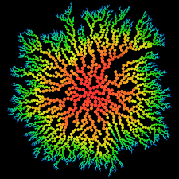
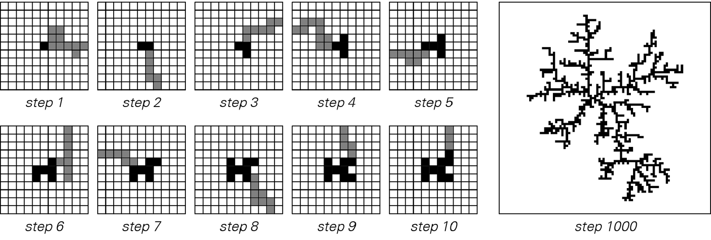
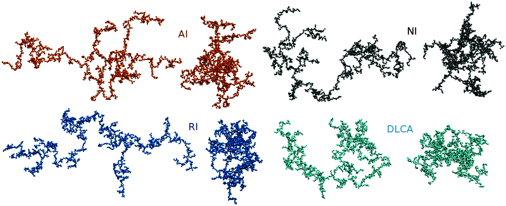

---
author:
  name: Федорова Анжелика, Чувакина Мария
  affiliation:
    - Российский университет дружбы народов

title: Алгоритмы решения задачи неравновесной агрегации
subtitle: Неравновесная агрегация и фракталы

date: today
lang: ru-RU

mainfont: "DejaVu Serif"
monofont: "DejaVu Sans Mono"

header-includes:
  - \usepackage{polyglossia}
  - \setmainlanguage{russian}
---

## Введение

Целью данного этапа является разработка алгоритма моделирования процесса
диффузионно-ограниченной агрегации (DLA), приводящего к формированию фрактальных структур.


## Постановка задачи

Требуется реализовать алгоритм, который:

- моделирует движение частиц;
- определяет момент их присоединения к кластеру;
- формирует растущую структуру.


## Общая схема алгоритма




## Основные этапы алгоритма

1. Инициализация начального кластера  
2. Генерация новой частицы  
3. Случайное перемещение частицы  
4. Проверка столкновения  
5. Присоединение к кластеру  
6. Повтор процесса  


## Алгоритм случайного блуждания



Частица перемещается случайным образом по решётке:
- вверх  
- вниз  
- влево  
- вправо  


## Формальное описание алгоритма

Обозначим:

- C — множество точек кластера  
- p — текущая частица  

Алгоритм:

1. p ← p₀  
2. Пока p не принадлежит C:
   - выполнить случайный шаг  
   - если сосед принадлежит C → добавить p в C  


## Псевдокод

```
C = {центр}

for i in range(N):
    p = стартовая позиция

    while True:
        p = случайный шаг(p)

        if рядом есть точка из C:
            добавить p в C
            break
```


## Проверка столкновения

Проверяются соседние клетки:
- (x+1, y)
- (x-1, y)
- (x, y+1)
- (x, y-1)


## Оптимизация

- ограничение области движения  
- удаление дальних частиц  
- генерация частиц ближе к кластеру  


## Результаты



- формируется фрактальная структура  
- наблюдается самоподобие  


## Выводы

- Алгоритм эффективно моделирует агрегацию  
- Простые правила → сложные структуры  
